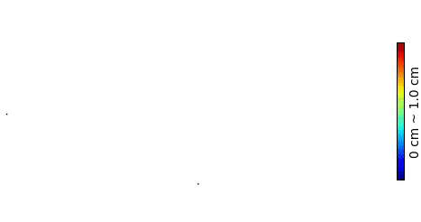

<p align="center">

  <h2 align="center">GauS-SLAM: Dense RGB-D SLAM with Gaussian Surfels</h2>
  <p align="center">
    <strong>Yongxin Su</strong><sup>1</sup>
    ·
    <strong>Lin Chen</strong><sup>2</sup>
    ·
    <strong>Kaiting Zhang</strong><sup>1</sup>
    ·
    <strong>Zhongliang Zhao</strong><sup>1</sup>
    ·
    <strong>Chenfeng Hou</strong><sup>1</sup>
    ·
    <strong>Ziping Yu</strong><sup>1</sup>
</p>

<!-- <p align="center"><strong>International Conference on 3D Vision (3DV) 2025</strong></a> -->
<p align="center">
    <sup>1</sup>Beihang University · <sup>2</sup>Northwestern Polytechnical University 
</p>
   <h3 align="center">

   [](https://arxiv.org/abs/2505.01934) [](https://gaus-slam.github.io/) [](https://opensource.org/licenses/MIT)
  <div align="center"></div>
</p>


<p align="center">
  <a href="">
    
  </a>
</p>

## 📃 Description
<!-- <p align="center">
  <a href="">
    
  </a>
</p> -->

**GauS-SLAM** is a coupled RGB-D SLAM system that achieves high-precision tracking and reconstruction through surface-aware depth rendering based on 2D Gaussian Splatting. The front-end performs tracking and reconstruction within local submaps, enhancing computational efficiency while mitigating  affection from interference regions in the global map. The back-end maintains global consistency by progressively merging these submaps generated by the front-end and performing submap-based bundle adjustment. Extensive evaluations on benchmark datasets including Replica and ScanNet++ demonstrate the system's superior performance.

# 🛠️ Setup
The code has been tested on:

- Ubuntu 20.04 LTS, Python 3.10.15, CUDA 12.2, GeForce RTX 3090/RTX 4090/A6000

## 📦 Repository

Clone the repo with `--recursive` because we have submodules:

```
git clone --recursive https://github.com/gaus-slam/gaus-slam.git
```

## 💻 Installation
Then setup environment from the provided requirements file,

```
conda create -n gaus python=3.10
conda activate gaus
conda install -c "nvidia/label/cuda-11.6.0" cuda-toolkit
pip install torch==1.12.1+cu116 torchvision==0.13.1+cu116 torchaudio==0.12.1 --extra-index-url https://download.pytorch.org/whl/cu116
pip install -r requirements.txt

# install pytorch3d offline
wget https://anaconda.org/pytorch3d/pytorch3d/0.7.5/do
wnload/linux-64/pytorch3d-0.7.5-py310_cu116_pyt1121.tar.bz2
conda install pytorch3d-0.7.5-py310_cu116_pyt1121.tar.bz2
```

## 🚀 Usage

Here we will introduce the usage of GauS-SLAM, experiments of the paper and visualization of the results.

### Datasets

  We evaluate our algorithm using the [Replica](https://github.com/facebookresearch/Replica-Dataset) , [TUM-RGBD](https://cvg.cit.tum.de/data/datasets/rgbd-dataset), [ScanNet](http://www.scan-net.org/), and [ScanNet++](https://kaldir.vc.in.tum.de/scannetpp/) datasets. The download instructions for these four datasets can be obtained from the [LoopSplat](https://github.com/GradientSpaces/loopsplat) project.

  We adopted the same evaluation scheme as [Point-SLAM](https://github.com/eriksandstroem/Point-SLAM) to assess the reconstruction performance on the Replica dataset. Therefore, the ground truth mesh must first be obtained following the procedure of this work.

  The ScanNet++ dataset requires preprocessing following the same pipeline adopted by the [SplaTAM](https://github.com/spla-tam/SplaTAM).


  ### Running
  Before running the code, you need to verify that the dataset paths in the `config` directory are correctly specified. To launch the SLAM demo for a specific dataset (e.g., Replica), use the following command:
  ```
  python scripts/gaus_mp.py configs/replica/config.py
  ```
  This command will start multi-processed training on the Room0 sequence by default. Note that since both the frontend and backend maintain separate maps in multi-processed mode, this leads to higher GPU memroy usage. 
  
  We have also implemented a single-processed demo with lower memory consumption, which can be launched using the following command:
  ```
  python scripts/gaus.py configs/replica/config.py
  ```
  After training completes, the corresponding results will be generated in the output directory by default.

  For faster running, use the following command:
  ```
  python scripts/gaus_mp.py configs/replica/config_fast.py
  ```
  ### Evaluation 
  During training, only *PSNR*, *SSIM*, *LPIPS*, and *ATE-RMSE* metrics are computed by default. To evaluate reconstruction metrics(*F-Score* and *Depth L1*), enable `eval_mesh` in configuration file or use the following command:
  ```
  python scripts/eval.py -m output/Replica_exp0_seed0/room0
  ```
  Specifically for the ScanNet++ dataset, novel view synthesis metrics can be computed with:
  ```
  python scripts/eval_nvs.py -m ./output/scannetpp_seed0/b20a261fdf
  ```
  ### Visualization
  We provide two visualization modes that can be enabled in the `backend` config of the configuration file:
  1. `render_vis`: Displays rendering results with trajectories.
  2. `mesh_vis`: Visualizes reconstructed mesh with trajectories (uses TSDF-Fusion, lower efficiency)

  Both modes support real-time online operation in the backend system. Additionally, enabling `gen_animation` in the `viz` config will generate corresponding visualization videos after training.

  You can also use the following command to generate a mesh visualization video after training completes:
  ```
  python scripts/gen_video.py -m ./output/Replica_exp0_seed0/room0
  ```
  Mesh video on `b20a261fdf` of ScanNet++ dataset.
  <p align="center">
    <a href="">
      
    </a>
  </p>
  To visualize rendering performance using interactive window, you can use the following command:

  ```
  python vis_final.py -m ./output/Replica_exp0_seed0/room0
  ```

  ### Experiments
  To support reproducibility, we have released testing scripts for the four benchmark datasets and two ablation configurations used in our paper. Note that slight result discrepancies may occur due to stochastic factors in the experimental pipeline. 
  ```
  bash scripts_bash/replica.bash
  ```
  In the ablation study, to validate the effectiveness of our framework, we support using either isotropic or anisotropic 3D Gaussian. This can be configured in the `render.method` parameter of the configuration file (where the `gaussians.gaussian_distribution` setting controls the isotropic/anisotropic).

  To evaluate the impact of sub-maps on tracking accuracy, our implementation additionally incorporates SplaTAM's tracking and mapping pipeline, invoked by:
  ```
  python scripts/splatam.py config/replica/splatam.py
  ```

<!-- ##  Contact -->
## Current Issues
1. Current BA (Bundle Adjustment) approach is relatively coarse and brute, and can't handle  large loop-closure errors.
2. Low computational efficiency. Although reducing the number of keyframes by adjusting parameter $\tau_k$ is feasible, a more effective approach might be to implement a convergence check for pose tracking. 
(fr3/xyz sequence in TUM-RGBD performance is relatively low, with an abnormally high frequency of submap generation during a certain period.) 
3. During map merging, some redundant Gaussians are difficult to eliminate, resulting in an excessive number of Gaussian primitives.
## Updating ...
hello, this is my first project. If you spot any issues in the code or paper, please feel free to point them out! The release was a bit rushed, so I’ll keep improving things like the project homepage, code comments, and parameter descriptions later.  
Yongxin Su 📧 zy2302321@buaa.edu.cn. 
<!-- # ✏️ Acknowledgement
Our implementation is heavily based on <a href="https://vladimiryugay.github.io/gaussian_slam/index.html">Gaussian-SLAM</a> and <a href="https://github.com/muskie82/MonoGS">MonoGS</a>. We thank the authors for their open-source contributions. If you use the code that is based on their contribution, please cite them as well. We thank [Jianhao Zheng](https://jianhao-zheng.github.io/) for the help with datasets and [Yue Pan](https://github.com/YuePanEdward) for the fruitful discussion.<br>

# 🎓 Citation

If you find our paper and code useful, please cite us:

```bib
@inproceedings{zhu2025_loopsplat,
      title={LoopSplat: Loop Closure by Registering 3D Gaussian Splats}, 
      author={Liyuan Zhu and Yue Li and Erik Sandström and Shengyu Huang and Konrad Schindler and Iro Armeni},
      year={2025},
      booktitle = {International Conference on 3D Vision (3DV)},
} -->
